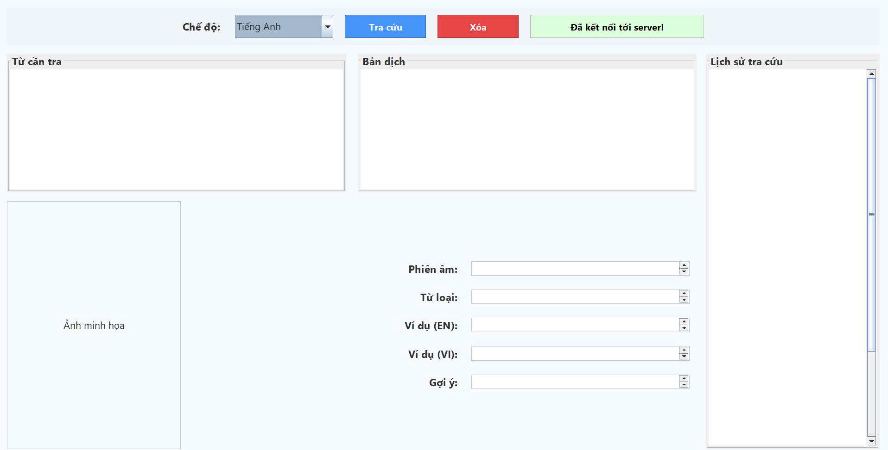
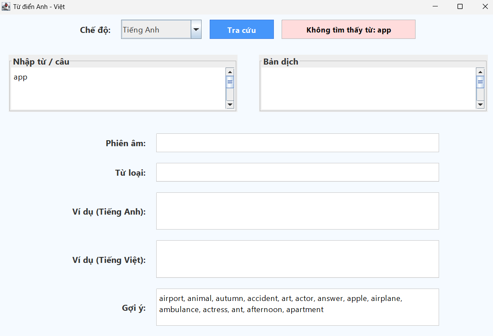
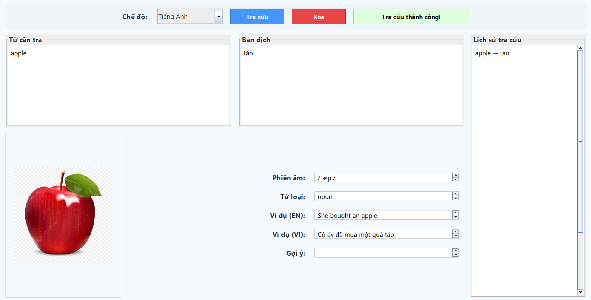
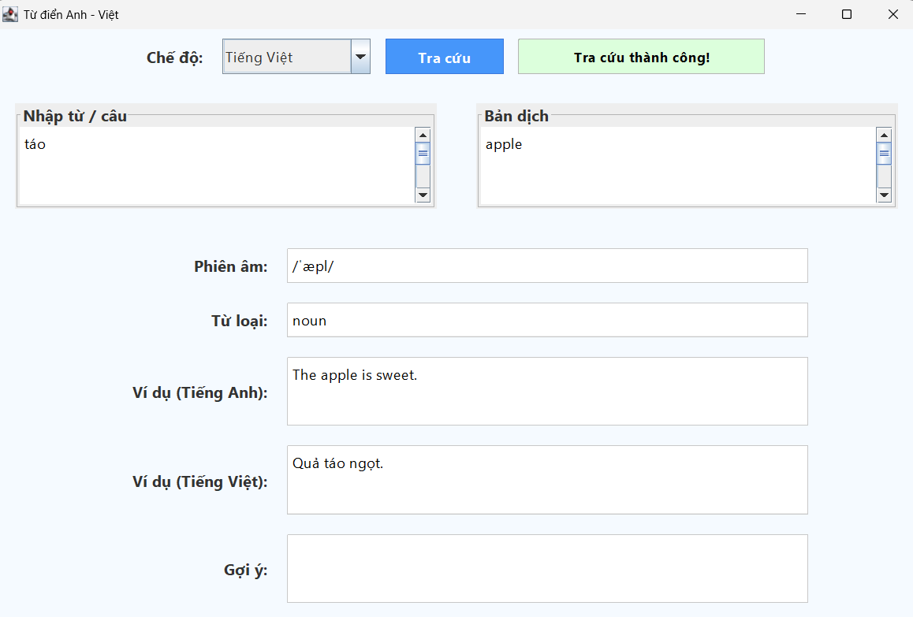
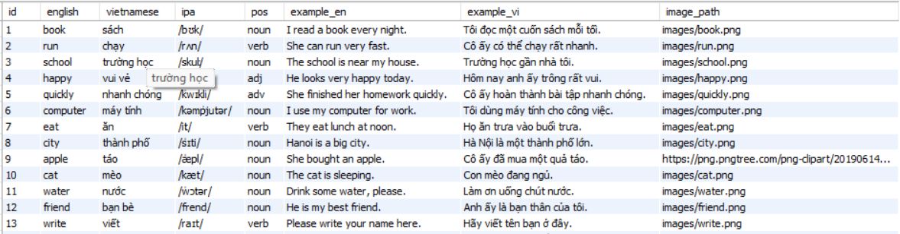

<h2 align="center">
    <a href="https://dainam.edu.vn/vi/khoa-cong-nghe-thong-tin">
    🎓 Faculty of Information Technology (DaiNam University)
    </a>
</h2>
<h2 align="center">
   ỨNG DỤNG TRA CỨU TỪ ĐIỂN ANH-VIỆT
</h2>
<div align="center">
    <p align="center">
        
        
        
    </p>

[](https://www.facebook.com/DNUAIoTLab)
[](https://dainam.edu.vn/vi/khoa-cong-nghe-thong-tin)
[](https://dainam.edu.vn)
</div>

## 1. Giới thiệu

Ứng dụng Tra Cứu Từ Điển Anh - Việt là một dự án học tập được phát triển bằng **Java Socket** và **Java Swing** trong khuôn khổ nghiên cứu tại **AIoTLab**, Khoa Công Nghệ Thông Tin, Đại học Đại Nam. Ứng dụng cung cấp một hệ thống client-server cho phép tra cứu từ vựng song ngữ (Tiếng Anh ↔ Tiếng Việt) với giao diện người dùng thân thiện và khả năng xử lý đa luồng hiệu quả.
### Cấu trúc ứng dụng:
- **Server**: 
  - Quản lý dữ liệu từ điển từ tệp `english-vietnamese.csv` hoặc sử dụng dữ liệu mặc định (apple, book, dog).
  - Hỗ trợ đa luồng để xử lý nhiều kết nối từ client đồng thời.
  - Chạy trên cổng 2000, lắng nghe các yêu cầu tra cứu từ client.
- **Client**: 
  - Giao diện đồ họa (GUI) được xây dựng bằng Java Swing.
  - Hỗ trợ tra cứu từ vựng, hiển thị thông tin chi tiết (nghĩa, phiên âm IPA, từ loại, ví dụ minh họa).
  - Cung cấp gợi ý từ khi không tìm thấy từ chính xác.

### 🔑 Tính năng chính:
- **Tra cứu song ngữ**: Hỗ trợ tra cứu từ tiếng Anh sang tiếng Việt và ngược lại.
- **Thông tin chi tiết**: Hiển thị nghĩa, phiên âm (IPA), từ loại, ví dụ minh họa bằng cả hai ngôn ngữ.
- **Gợi ý thông minh**: Gợi ý các từ bắt đầu bằng ký tự đầu tiên khi từ tra cứu không tồn tại.
- **Giao diện trực quan**: Giao diện client sử dụng Java Swing với bố cục rõ ràng, dễ sử dụng.
- **Hỗ trợ đa luồng**: Server có thể xử lý nhiều client cùng lúc mà không bị gián đoạn.
- **Quản lý dữ liệu linh hoạt**: Dữ liệu từ điển được tải từ tệp CSV (hỗ trợ UTF-8) hoặc dữ liệu mặc định.

### Mục tiêu:
Ứng dụng được thiết kế để hỗ trợ học tập từ vựng Anh-Việt, đặc biệt phù hợp với học sinh, sinh viên và những người muốn tra cứu nhanh từ vựng. Dự án cũng là một bài tập thực hành về lập trình mạng (Socket) và giao diện người dùng (Swing).

## 2. Công nghệ sử dụng

### Client
<p align="center">
    
    
</p>

- **Java**: Ngôn ngữ lập trình chính, đảm bảo tính đa nền tảng.
- **Java Swing**: Thư viện tạo giao diện đồ họa, cung cấp các thành phần như ô nhập liệu, nút bấm, combobox và khu vực hiển thị kết quả.

### Server
<p align="center">
    
    
    
</p>

- **Java Socket**: Xử lý giao tiếp mạng giữa client và server thông qua giao thức TCP.
- **Multithreading**: Mỗi client được xử lý trên một luồng riêng, đảm bảo server hoạt động ổn định với nhiều kết nối.

### Quản lý dữ liệu
<p align="center">
    
    
</p>

- **CSV**: Tệp `english-vietnamese.csv` lưu trữ dữ liệu từ điển với các trường: từ tiếng Anh, nghĩa tiếng Việt, phiên âm, từ loại, ví dụ tiếng Anh, ví dụ tiếng Việt.
- **UTF-8 Encoding**: Đảm bảo hỗ trợ tiếng Việt đầy đủ, tránh lỗi hiển thị ký tự.

## 3. Hình ảnh chương trình

### Giao diện Client
- **Giao diện chính**:
    <p align="center">
        
    </p>

- **Gợi ý khi không tìm thấy từ**:
    <p align="center">
        
    </p>

- **Tra cứu tiếng Anh sang tiếng Việt**:
    <p align="center">
        
    </p>
 

- **Tra cứu tiếng Việt sang tiếng Anh**:
    <p align="center">
        
    </p>

### Kho từ CSV
- **Tệp dữ liệu mẫu**:
    <p align="center">
        
    </p>

## 4. Hướng dẫn cài đặt

### Điều kiện tiên quyết
- **Java Development Kit (JDK)**: Phiên bản 8 hoặc cao hơn (khuyến nghị JDK 17 để đảm bảo tương thích).
- **Môi trường phát triển**: Sử dụng IDE như Eclipse, IntelliJ IDEA hoặc biên dịch thủ công bằng `javac`.
- **Hệ điều hành**: Windows, macOS, Linux (đã kiểm tra trên Windows 10 và Ubuntu 20.04).
- **Công cụ bổ sung** (tùy chọn): Git để clone repository, Notepad++ hoặc VSCode để chỉnh sửa tệp CSV.

### Các bước cài đặt
1. **Tải mã nguồn**:
   - Clone repository từ GitHub (hoặc tải file zip):
     ```
     git clone https://github.com/yourusername/tudien.git
     ```
   - Hoặc tải trực tiếp `Server.java` và `Client.java`.
   - Tạo thư mục dự án với cấu trúc:
     ```
     tudien/
     ├── Server.java
     ├── Client.java
     └── english-vietnamese.csv (tùy chọn)
     ```

2. **Chuẩn bị dữ liệu**:
   - Tạo tệp `english-vietnamese.csv` trong thư mục dự án với định dạng:
     ```
     english,vietnamese,ipa,part_of_speech,example_en,example_vi
     apple,quả táo,/ˈæp.l̩/,danh từ,I ate an apple for breakfast.,Tôi ăn một quả táo vào bữa sáng.
     book,cuốn sách,/bʊk/,danh từ,She is reading a book in the library.,Cô ấy đang đọc một cuốn sách trong thư viện.
     dog,con chó,/dɒɡ/,danh từ,The dog is playing in the yard.,Con chó đang chơi ngoài sân.
     ```
   - **Lưu ý**: 
     - Tệp phải sử dụng encoding **UTF-8** (có thể chỉnh sửa bằng Notepad++ hoặc VSCode).
     - Nếu không có tệp, ứng dụng sẽ sử dụng dữ liệu mặc định với 3 từ: apple, book, dog.
     - Có thể thêm nhiều từ vào tệp CSV để mở rộng từ điển.

3. **Biên dịch mã nguồn**:
   - Mở terminal/command prompt, di chuyển đến thư mục dự án:
     ```
     cd tudien
     ```
   - Biên dịch cả hai file:
     ```
     javac tudien/*.java
     ```
   - Kiểm tra lỗi biên dịch (thường do thiếu JDK hoặc cấu hình sai).

4. **Chạy ứng dụng**:
   - **Khởi động Server**:
     ```
     java tudien.Server
     ```
     - Server sẽ chạy trên cổng 2000, tải dữ liệu từ điển và hiển thị số lượng từ đã tải.
   - **Khởi động Client**:
     ```
     java tudien.Client
     ```
     - Giao diện client sẽ xuất hiện và tự động kết nối đến `localhost:2000`.

5. **Kiểm tra kết nối**:
   - Nếu client hiển thị trạng thái **"Đã kết nối tới server!"** (màu xanh), ứng dụng đã sẵn sàng.
   - Nếu gặp lỗi (ví dụ: "Không kết nối được server!"), kiểm tra:
     - Server đã chạy chưa.
     - Firewall có chặn cổng 2000 không.
     - Địa chỉ `localhost` trong `Client.java` có đúng không (nếu chạy trên mạng, thay bằng IP server).

### Hướng dẫn sử dụng
1. **Khởi động ứng dụng**:
   - Chạy Server trước để lắng nghe kết nối.
   - Mở Client, giao diện sẽ hiển thị trạng thái kết nối.

2. **Tra cứu từ**:
   - Chọn chế độ tra cứu (**Tiếng Anh** hoặc **Tiếng Việt**) từ combobox.
   - Nhập từ cần tra vào ô **"Nhập từ / câu"**.
   - Nhấn nút **"Tra cứu"**.
   - Kết quả hiển thị ở các ô:
     - **Bản dịch**: Nghĩa của từ.
     - **Phiên âm**: Phát âm theo chuẩn IPA.
     - **Từ loại**: Danh từ, động từ, tính từ, v.v.
     - **Ví dụ (Tiếng Anh)**: Câu ví dụ bằng tiếng Anh.
     - **Ví dụ (Tiếng Việt)**: Câu ví dụ bằng tiếng Việt.
   - Nếu không tìm thấy từ, ô **"Gợi ý"** sẽ hiển thị các từ bắt đầu bằng ký tự đầu tiên.

3. **Thoát ứng dụng**:
   - Đóng cửa sổ Client sẽ gửi lệnh `EXIT` đến Server và ngắt kết nối.
   - Dừng Server bằng phím `Ctrl+C` trong terminal.

### Lưu ý:
- Ứng dụng hiện chỉ hỗ trợ tra cứu từ đơn. Để hỗ trợ cụm từ hoặc câu, cần nâng cấp logic xử lý.
- Để triển khai trên mạng, chỉnh sửa `localhost` trong `Client.java` thành địa chỉ IP của server.
- Nếu gặp lỗi hiển thị tiếng Việt, kiểm tra encoding của tệp CSV (phải là UTF-8).

## 5. Thông tin liên hệ

- **Họ tên**: Nguyễn Đức Duy  
- **Lớp**: CNTT 16-01  
- **Email**: [Nguyenducduy2612@icloud.com](mailto:Nguyenducduy2612@icloud.com)  
- **GitHub**: [github.com/nguyenducduy2612/Ung_Dung_Tra_Cuu_Tu_Dien_Anh_Viet](github.com/nguyenducduy2612/Ung_Dung_Tra_Cuu_Tu_Dien_Anh_Viet) 
- **Phòng thí nghiệm**: AIoTLab, Khoa Công Nghệ Thông Tin, Đại học Đại Nam  
- **Website**: [dainam.edu.vn](https://dainam.edu.vn)  
- **Facebook AIoTLab**: [facebook.com/DNUAIoTLab](https://www.facebook.com/DNUAIoTLab)

Nếu bạn có câu hỏi, gặp lỗi, hoặc muốn đề xuất tính năng mới (ví dụ: hỗ trợ tra cứu trực tuyến, thêm ngôn ngữ khác), hãy liên hệ qua email hoặc mở issue trên GitHub. Mọi đóng góp đều được hoan nghênh!

© 2025 AIoTLab, Khoa Công Nghệ Thông Tin, Đại học Đại Nam.
